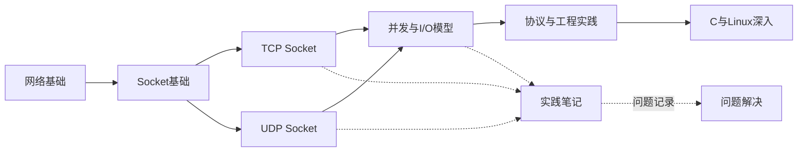

# Socket 学习知识库 - 主索引

## 学习目标

- [ ] 理解网络通信的基本概念
- [ ] 能够编写 TCP 客户端和服务器
- [ ] 能够编写 UDP 客户端和服务器
- [ ] 理解并发与 I/O 模型
- [ ] 能够设计简单的应用层协议
- [ ] 能够使用 C/Linux 深入分析 Socket 行为

## 主线关系

## 学习阶段

| 阶段 | 状态 | 入口 |
|---|---|---|
| 01 基础入门 | 未开始 | [[01-基础入门/README]] |
| 02 TCP Socket | 未开始 | [[02-TCP Socket/README]] |
| 03 UDP Socket | 未开始 | [[03-UDP Socket/README]] |
| 04 并发与 I/O 模型 | 未开始 | [[04-并发与I-O模型/README]] |
| 05 协议与工程实践 | 未开始 | [[05-协议与工程实践/README]] |
| 08 C 与 Linux 深入 | 未开始 | [[08-C与Linux深入/README]] |

## 辅助模块

- [[06-实践笔记/README]]
- [[07-问题解决/README]]
- [[使用指南]]

## 总体进度

- [ ] 第一阶段完成
- [ ] 第二阶段完成
- [ ] 第三阶段完成
- [ ] 第四阶段完成
- [ ] 第五阶段完成
- [ ] 深入阶段完成
