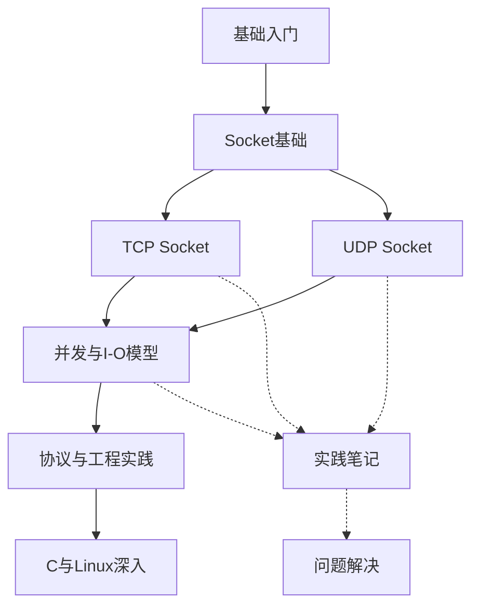

# Socket 学习关系图

## 推荐主线

```mermaid
flowchart TD
    A[基础入门] --> B[Socket基础]
    B --> C[TCP Socket]
    B --> D[UDP Socket]
    C --> E[并发与I-O模型]
    D --> E
    E --> F[协议与工程实践]
    F --> G[C与Linux深入]
    C -.-> H[实践笔记]
    D -.-> H
    E -.-> H
    H -.-> I[问题解决]
```

## 阅读方式

- 实线表示建议的学习顺序。
- 虚线表示辅助记录或复习关系。
- 具体内容等学到对应阶段后再补充。
