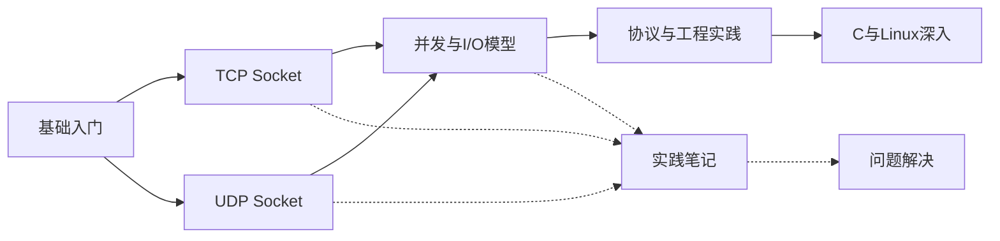

# Socket 学习关系图

```mermaid
graph LR
    A[基础入门] --> B[TCP Socket]
    A --> C[UDP Socket]
    B --> D[并发与I/O模型]
    C --> D
    D --> E[协议与工程实践]
    E --> F[C与Linux深入]
    B -.-> G[实践笔记]
    C -.-> G
    D -.-> G
    G -.-> H[问题解决]
```

具体主题关系见 [[00-索引/关系图]] 和各阶段 README。
